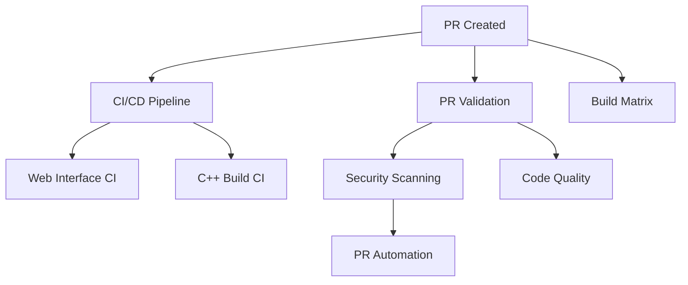
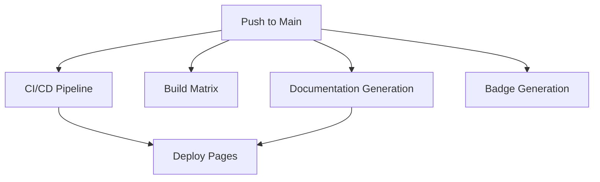
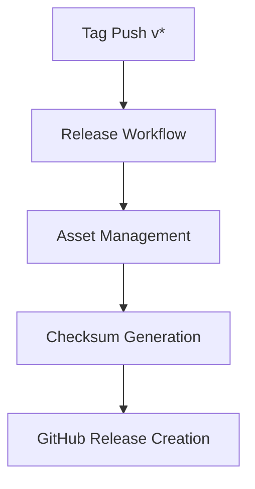

# GitHub Actions Workflow Summary

## 📋 Quick Reference

This document provides a quick overview of all GitHub Actions workflows in the Security Sentinel repository.

## Workflow Categories

### 🏗️ Build & Test Workflows

| Workflow | File | Triggers | Purpose |
|----------|------|----------|---------|
| **CI/CD Pipeline** | `ci.yml` | Push, PR | Main integration pipeline |
| **Web Interface CI** | `ci-web.yml` | Push, PR | Web-specific builds and tests |
| **C++ Build CI** | `ci-cpp.yml` | Push, PR | C++ specific builds |
| **Build Matrix** | `build-matrix.yml` | Push, PR | Multi-platform matrix builds |
| **Workflow Test** | `workflow-test.yml` | Manual | Workflow testing |

### 🔐 Security & Quality Workflows

| Workflow | File | Triggers | Purpose |
|----------|------|----------|---------|
| **Security Scanning** | `security.yml` | Push, PR, Schedule | CodeQL and dependency scanning |
| **Code Quality** | `code-quality.yml` | Push, PR | Linting and code quality checks |
| **PR Validation** | `pr-validation.yml` | PR | Pull request validation |

### 📚 Documentation Workflows

| Workflow | File | Triggers | Purpose |
|----------|------|----------|---------|
| **Documentation** | `docs.yml` | Push (*.md files) | Basic documentation checks |
| **Documentation Generation** | `documentation-generation.yml` | Push (src files) | API docs generation (C++, TS, Go) |
| **Deploy Pages** | `deploy-pages.yml` | Push to main | GitHub Pages deployment |

### 📦 Release & Asset Workflows

| Workflow | File | Triggers | Purpose |
|----------|------|----------|---------|
| **Release** | `release.yml` | Tag push (v*.*.*) | Release builds and packaging |
| **Asset Management** | `asset-management.yml` | Release, Manual | Asset packaging and checksums |
| **Badge Generation** | `badge-generation.yml` | Push to main, Schedule | Dynamic badge generation |
| **Artifact Cleanup** | `artifact-cleanup.yml` | Schedule, Manual | Artifact lifecycle management |

### 🤖 Automation Workflows

| Workflow | File | Triggers | Purpose |
|----------|------|----------|---------|
| **PR Automation** | `pr-automation.yml` | PR | Automated PR labeling and actions |

## Workflow Execution Order

### On Pull Request



### On Push to Main



### On Release Tag



## Common Workflow Patterns

### Caching Strategy

All build workflows use aggressive caching:

```yaml
# NPM Dependencies
uses: actions/cache@v4
with:
  path: ~/.npm
  key: ${{ runner.os }}-npm-${{ hashFiles('**/package-lock.json') }}

# CMake Builds
uses: actions/cache@v4
with:
  path: build/
  key: ${{ runner.os }}-cmake-${{ hashFiles('**/CMakeLists.txt') }}

# Go Modules
uses: actions/setup-go@v5
with:
  cache: true
  cache-dependency-path: core-go/go.sum
```

### Artifact Retention

| Type | Retention | Workflows |
|------|-----------|-----------|
| CI Builds | 14 days | ci.yml, build-matrix.yml |
| Documentation | 90 days | documentation-generation.yml |
| Release Assets | 90 days | release.yml, asset-management.yml |
| Badges | 365 days | badge-generation.yml |

### Parallel Execution

Workflows are designed to run in parallel where possible:
- Multiple build configurations run simultaneously
- Documentation generation runs in parallel (C++, TS, Go)
- Platform-specific builds are independent

## Workflow Triggers

### Schedule Triggers

| Workflow | Schedule | Day | Time (UTC) |
|----------|----------|-----|------------|
| Security Scanning | Weekly | Sunday | 02:00 |
| Artifact Cleanup | Weekly | Sunday | 02:00 |
| Badge Generation | Weekly | Sunday | 00:00 |

### Manual Triggers

All workflows support `workflow_dispatch` for manual execution.

### Automatic Triggers

- **Push Events**: Main CI/CD workflows
- **PR Events**: Validation and testing workflows
- **Release Events**: Asset management and packaging
- **Tag Events**: Release workflow

## Workflow Outputs

### Build Artifacts

```
artifacts/
├── cpp-windows-latest-Release/
│   └── SecuritySentinel.exe
├── cpp-ubuntu-latest-Release/
│   └── SecuritySentinel
├── go-ubuntu-latest/
│   ├── libcore.a
│   └── coverage.out
└── web-build/
    └── dist/
```

### Documentation Artifacts

```
docs/
├── cpp-api/
│   └── html/
├── ts-api/
│   └── index.html
├── go-api/
│   └── index.html
└── dependencies/
    └── index.html
```

### Badge Files

```
badges/
├── version.json
├── loc.json
├── cpp.json
├── go.json
└── typescript.json
```

## Troubleshooting

### Common Issues

**Build fails on specific platform:**
```bash
# Check platform-specific logs
# Look for configuration issues
# Verify dependencies are available
```

**Documentation generation fails:**
```bash
# Verify Doxygen/TypeDoc installation
# Check source file paths
# Review configuration files
```

**Artifact upload fails:**
```bash
# Check artifact size (max 2GB)
# Verify path patterns
# Check retention policy
```

**Badge not updating:**
```bash
# Re-run badge-generation workflow
# Verify badge JSON is committed to main
# Check shields.io endpoint
```

## Performance Metrics

### Average Execution Times

| Workflow | Duration | Parallelizable |
|----------|----------|----------------|
| CI/CD Pipeline | 8-12 min | Yes |
| Build Matrix | 15-25 min | Yes |
| Documentation Generation | 5-7 min | Yes |
| Security Scanning | 10-15 min | Partial |
| Release | 20-30 min | Yes |

### Resource Usage

| Resource | Usage | Limit |
|----------|-------|-------|
| Concurrent Jobs | ~10 | 20 (Free tier) |
| Storage | 2-5 GB | 10 GB (Free tier) |
| Minutes/Month | ~500 | 2000 (Free tier) |

## Best Practices

### For Contributors

1. ✅ Always run local builds before pushing
2. ✅ Wait for CI to complete before requesting review
3. ✅ Check artifact outputs for your changes
4. ✅ Update documentation if adding new features

### For Maintainers

1. ✅ Monitor workflow execution times
2. ✅ Review and approve workflow changes carefully
3. ✅ Keep secrets up to date
4. ✅ Regularly review artifact storage usage
5. ✅ Update workflow documentation

## Security Considerations

### Secrets Used

- `GITHUB_TOKEN` - Automatic, for API access
- `GEMINI_API_KEY` - For AI features (if configured)

### Permissions

All workflows use minimal permissions:
```yaml
permissions:
  contents: read
  actions: read
```

Release workflows require:
```yaml
permissions:
  contents: write
```

## Maintenance

### Weekly Tasks

- Review artifact storage usage
- Check for failed scheduled workflows
- Update dependencies if needed

### Monthly Tasks

- Review and optimize workflow performance
- Update action versions
- Clean up old artifacts manually if needed

### Quarterly Tasks

- Audit workflow permissions
- Review and update documentation
- Evaluate new GitHub Actions features

## Related Documentation

- [Advanced Workflows Guide](ADVANCED_WORKFLOWS.md)
- [Contributing Guide](../CONTRIBUTING.md)
- [Release Process](../create-release.md)
- [GitHub Actions Documentation](https://docs.github.com/en/actions)

## Support

For workflow issues:
1. Check workflow logs in Actions tab
2. Review this documentation
3. Check [GitHub Actions status](https://www.githubstatus.com/)
4. Create an issue with `workflow` label

---

**Last Updated**: December 2024  
**Maintained by**: GizzZmo  
**Total Workflows**: 12
